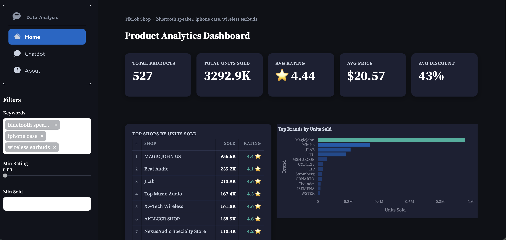
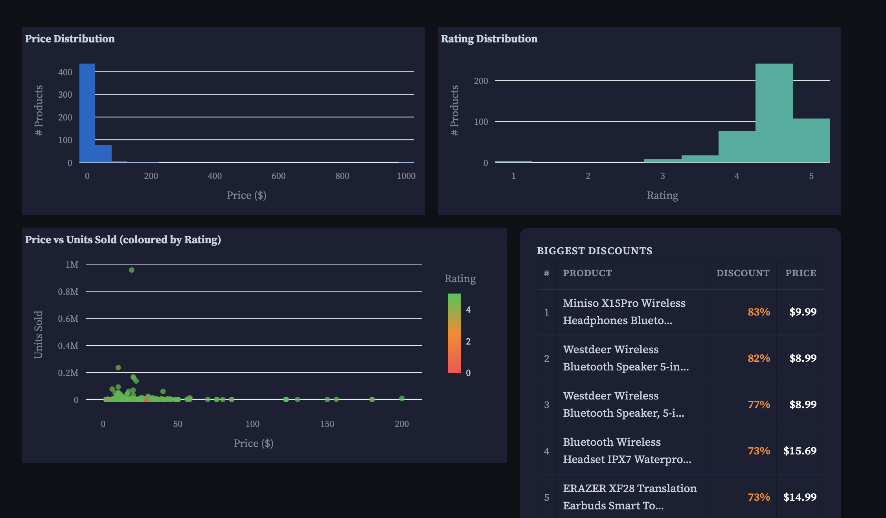
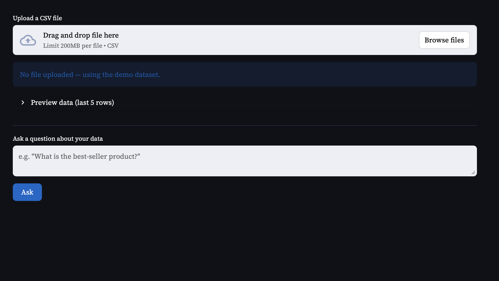

# TikTok Shop Analytics Dashboard



## Project Overview

A full-stack data collection and analytics dashboard for TikTok Shop products. Search for any product keyword, collect live data via the TikTok Shop US API, and explore it through an interactive Streamlit dashboard with built-in AI chat analysis powered by PandasAI.

---

## Features

### 🔍 Data Collection
- Search TikTok Shop products by one or more keywords
- Page-based pagination — collect up to ~300 products per keyword (10 pages × 30 products)
- Data saved automatically to `tiktok_search_data.csv`
- Configurable number of pages per keyword via the UI

### 📊 Interactive Dashboard
- **KPI Cards** — Total Products, Total Sold, Avg Rating, Avg Price, Avg Discount
- **Top Shops by Sold** — ranked table of best-performing sellers
- **Top Brands by Sold** — horizontal bar chart
- **Price Distribution** — histogram of product prices
- **Rating Distribution** — histogram of product ratings
- **Price vs Sold Scatter** — bubble chart coloured by rating
- **Biggest Discounts** — table of top discounted products
- **Sales by Keyword** — compare performance across search terms
- **Sidebar Filters** — filter by keyword, minimum rating, minimum sold count

### 🤖 AI Chat Analysis

- Upload any CSV or use the collected TikTok dataset
- Ask natural language questions about your data (e.g. *"What is the best-selling product?"*)
- Powered by PandasAI v3 + OpenAI GPT

---

## Tools & Technologies

| Tool | Purpose |
|---|---|
| Python 3.x | Core language |
| Streamlit | Interactive dashboard & UI |
| Requests | TikTok Shop US API calls |
| Pandas | Data manipulation |
| Plotly | Charts and visualisations |
| PandasAI v3 | Natural language data analysis |
| OpenAI GPT | AI backend for chat |

---

## Getting Started

### Prerequisites
- Python 3.10+
- A [RapidAPI](https://rapidapi.com) account subscribed to the **TikTok Shop US API**
- An OpenAI API key (for the AI chat page)

### Installation

```bash
git clone https://github.com/your-username/streamlit-dashboard-tiktokapi.git
cd streamlit-dashboard-tiktokapi
pip install -r requirements.txt
```

### Run the App

```bash
streamlit run main/app.py
```

---

## Usage

1. Create a new `.env` file and put the RapidAPIKey in it. (You can get the key from [this link](https://tiktok-shop-us-api.p.rapidapi.com) )
2. Go to the **Home** page
3. Enter one or more **product keywords** (one per line)
4. Click **Collect Data** — results are saved to `tiktok_search_data.csv`
5. Navigate to the **Dashboard** tab to explore the data visually
6. Navigate to the **Chat** tab to ask AI questions about the data

---

## Project Structure

```
streamlit-dashboard-tiktokapi/
├── main/
│   ├── app.py                  # Entry point
│   ├── home.py                 # Data collection page
│   ├── dashboard.py            # Analytics dashboard
│   ├── chat.py                 # PandasAI chat page
│   ├── data.py                 # TikTok Shop API client & CSV helpers
│   └── tiktok_search_data.csv  # Collected data (auto-generated)
├── images/
│   └── dashboard.png
├── requirements.txt
└── README.md
```

---

## Contact

For any questions or feedback, please contact [sonphamwork7@gmail.com](mailto:sonphamwork7@gmail.com).